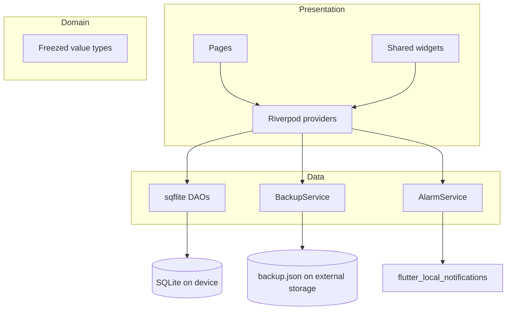

# Private Workout Log

*Android-first Flutter app for logging gym workouts. Track exercises,
body parts worked, sets and reps per session, dated. Offline-only,
SQLite-backed, no account, no network.*

[](https://github.com/Lukk17/workout_log/actions/workflows/ci.yml)
[](https://play.google.com/store/apps/details?id=com.lukk.workoutlog)
[](https://docs.flutter.dev/)
[](#license)

## What it is

A personal workout log built around two design choices most fitness
apps don't make: **it works fully offline**, and **it has no account,
no cloud, no telemetry**. Your data stays in a local SQLite database
on the device, with manual JSON backup if you want it.

Single-developer Flutter project, published to Google Play
(`com.lukk.workoutlog`), and intentionally kept narrow: log what you
lifted, when, and which body parts you worked. No social features,
no built-in exercise library to maintain, no premium tier.

## Features

- Calendar-based session log; tap a date to see that day's sets
- Add exercises with primary and secondary body parts (custom list,
  no fixed library)
- Track sets and reps per exercise per session
- Local SQLite persistence — no account, no cloud, no telemetry
- Manual JSON backup and restore to external storage
- Configurable rest timer with a local notification when it fires
- Light / dark theme with custom background images
- Pure Riverpod state, providers in `lib/presentation/providers/`

## Architecture



`lib/` follows the standard three-layer split. Pages and widgets read
and write through Riverpod providers; the providers wrap DAOs and
services. Nothing in the presentation layer talks to SQLite or the
notification plugin directly. The domain models in `lib/domain/` are
all `freezed` value types with generated equality and JSON.

## Quick start

Clone the repo, then from the project root run the standard Flutter
bring-up:

```bash
flutter pub get
```

Generate the `freezed` and `json_serializable` outputs (one-time, and
again whenever a model changes):

```bash
dart run build_runner build
```

If a regen fails because stale generated files conflict, wipe them
first:

```bash
dart run build_runner clean
```

(The old `--delete-conflicting-outputs` flag was removed in
`build_runner` 2.15+.)

List attached devices and emulators:

```bash
flutter devices
```

Run on a specific device, where `<deviceId>` is the id printed by the
previous command (e.g. `emulator-5554`):

```bash
flutter run -d <deviceId>
```

Add `-v` for verbose output or `--release` for a release-mode build.

If you hit weird build-cache issues:

```bash
flutter clean
```

## Deployment

Release builds ship to the Google Play Store via a manual GitHub
Actions workflow. See [docs/DEPLOYMENT.md](./docs/DEPLOYMENT.md) for
the full procedure: how to trigger a release, the five GitHub secrets
you need to configure (upload keystore + Google Play API service
account), what the workflow actually does step-by-step, common failure
modes and their fixes, and the manual `flutter build appbundle` path
for when CI is unavailable. The first-time keystore-signing setup is
in there too.

## Docs

| File | Covers |
|---|---|
| [docs/DEPLOYMENT.md](./docs/DEPLOYMENT.md) | Release process, signing model, GitHub secrets |
| [docs/AGENT_TOOLING.md](./docs/AGENT_TOOLING.md) | How the project is set up for AI coding agents (Claude Code, Codex, etc.) |
| [AGENTS.md](./AGENTS.md) | Agent-facing instructions and skill references |
| [.agents/skills/](./.agents/skills/) | Project-scoped skills (code-formatter, openspec workflow, etc.) |

## License

Personal project, all rights reserved by Łukasz Sarna. No public
license. The source is published for portfolio and agent-tooling
demonstration; not intended for redistribution or repackaging.
